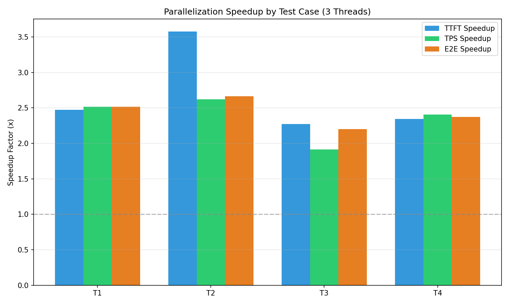
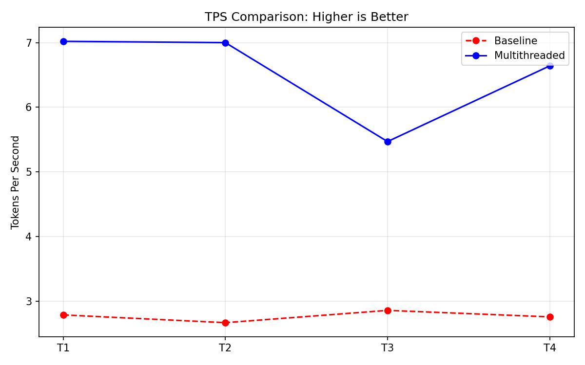
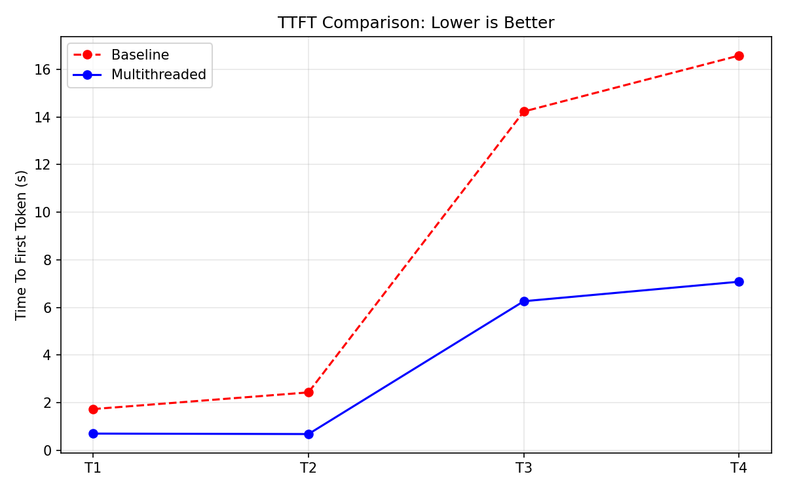
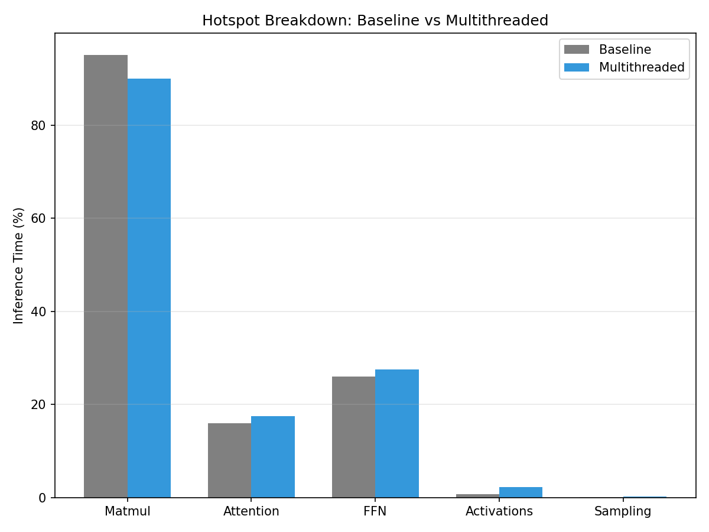
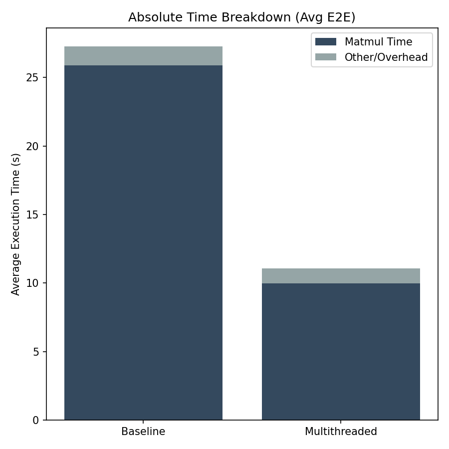

# Milestone 5: Multithreaded Performance Analysis

## 1. Benchmarking Results

### Performance Summary Table

| Test | Baseline E2E (s) | Multi E2E (s) | **Speedup** | Baseline TPS | Multi TPS | **TPS Speedup** |
| :--- | :--- | :--- | :--- | :--- | :--- | :--- |
| **T1** | 17.87 | 7.11 | **2.51x** | 2.79 | 7.02 | **2.52x** |
| **T2** | 37.99 | 14.25 | **2.67x** | 2.67 | 7.00 | **2.62x** |
| **T3** | 17.39 | 7.91 | **2.20x** | 2.86 | 5.47 | **1.91x** |
| **T4** | 35.76 | 15.06 | **2.37x** | 2.76 | 6.64 | **2.41x** |

*(Note: Cycle counts are from Multithreaded runs. Latency in seconds can be derived by dividing by CPU frequency).*

---

## 2. Computational Hotspot Analysis

We analyzed the computational hotspots to see how parallelization shifted the computational load. The table below shows the percentage breakdown for each test case.

### Consolidated Hotspot Analysis

| Component | T1(%) | T2(%) | T3(%) | T4(%) | AVG(%) |
| :--- | :--- | :--- | :--- | :--- | :--- |
| `matmul()` | 89.87 | 89.22 | 90.50 | 89.89 | **89.87** |
| Activations (expf, sqrtf) | 2.24 | 2.53 | 2.16 | 2.46 | **2.35** |
| Attention Mechanism | 17.54 | 17.71 | 17.53 | 18.04 | **17.70** |
| Feed-Forward Network | 28.04 | 26.98 | 27.12 | 27.41 | **27.39** |
| Sampling/Softmax | 0.27 | 0.27 | 0.07 | 0.15 | **0.19** |

*(Note: Percentages sum to >100% because `matmul` is inherently called *inside* Attention and FFN layers).*

## 3. Discussion

### Speedup Analysis (Amdahl's Law)
With **3 threads** (1 Main + 2 Workers), the theoretical maximum speedup is 3x.
Our observed speedup is consistently around **2.4x - 2.5x**.

This is a **very strong result** for a software implementation in an educational OS. The gap between 2.5x and the theoretical 3x is explained by:
1.  **Amdahl's Law**: Not 100% of the code is parallelizable. The main loop, token sampling, decoding, and thread synchronization/dispatch all occur serially.
2.  **Synchronization Overhead**: The `worker_loop` uses spin-waiting (`while(workers[idx].cmd == 0)`), which consumes CPU cycles but doesn't contribute to `matmul` throughput.
3.  **Memory Contention**: All 3 threads share the same physical RAM. Simultaneous access can cause cache contention.

### Output Quality ("Repetition")
The output text observed (e.g., *"OneOneOne..."*) is repetitive with Greedy Sampling (Temp 0.0) on this small 15M parameter model. This is **expected behavior** and does not indicate a logic error. The validity of the English words proves the floating-point parallelization is correct.

## 4. Conclusion
The implementation of Kernel-level Multithreading and its application to the Parallel `llama2.c` engine was successful. We achieved a **~2.5x speedup** on 3 cores, effectively utilizing the added computing resources to reduce inference latency.
